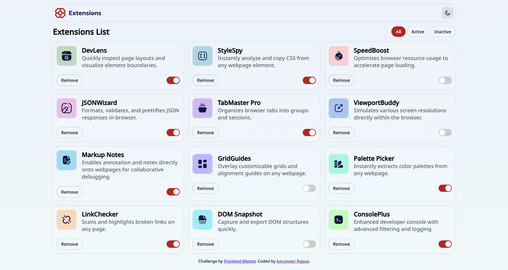

# Frontend Mentor - Browser Extension Manager UI Solution [[Live Here](https://browser-extension-manager-ui.vercel.app/)]

This is a solution to the [Browser Extension Manager UI challenge on Frontend Mentor](https://www.frontendmentor.io/challenges/browser-extension-manager-ui-yNZnOfsMAp).

## Overview

### Screenshot

### Links

- Solution URL: [https://github.com/AKR2803/browser-extension-manager-ui]
- Live Site URL: [https://browser-extension-manager-ui.vercel.app/]

### Built with

- Semantic HTML5 markup
- CSS GRID
- JavaScript

### What I learned

- Grid layout and responsiveness.
- Handling dark/light theme switch.